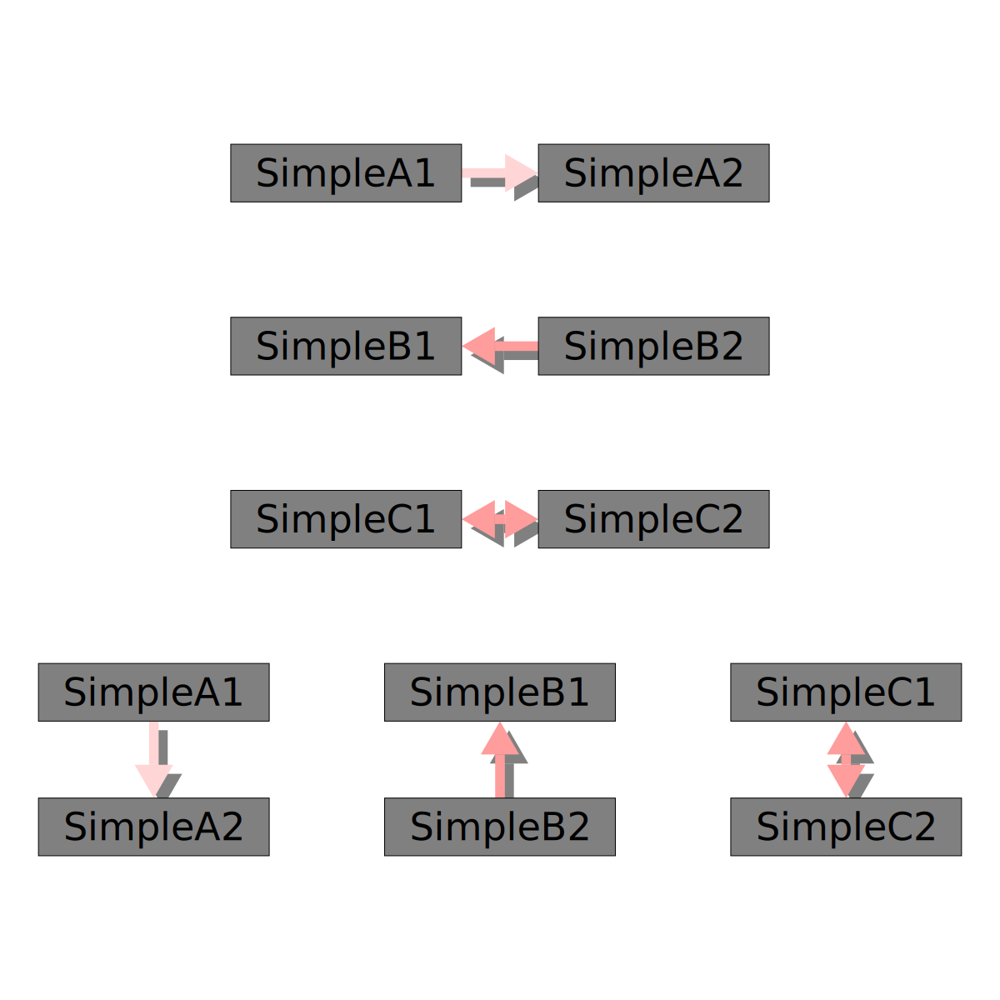
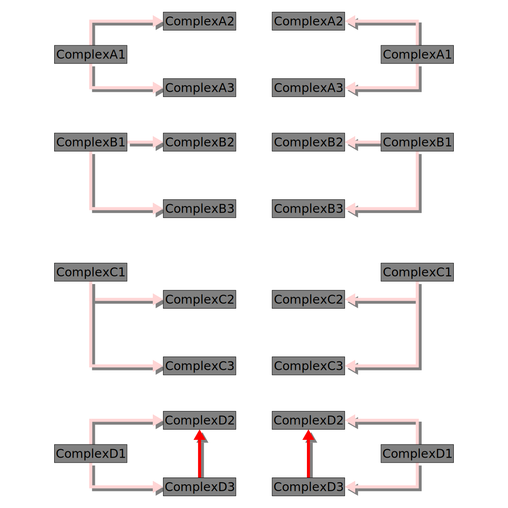
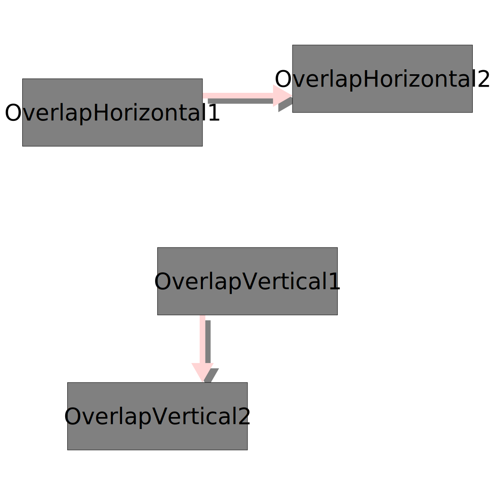
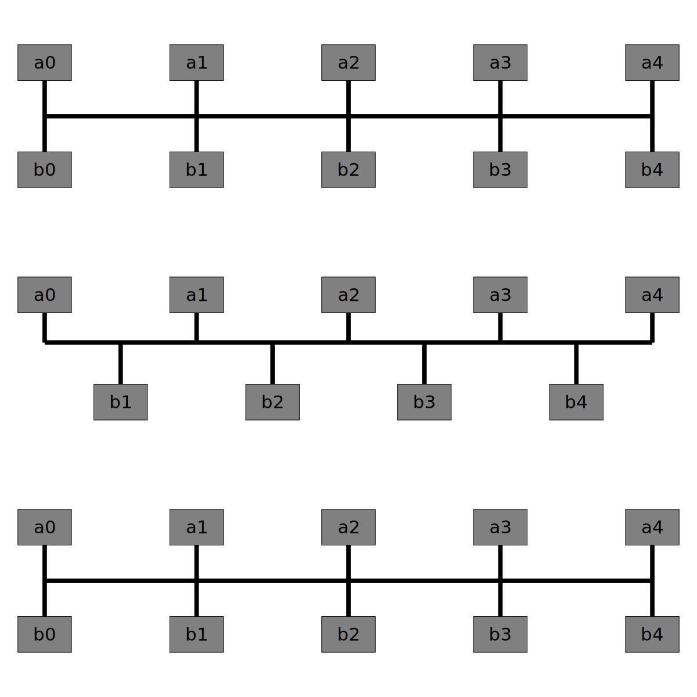

# Library for right-angle connectors

See [Google Groups post](https://groups.google.com/forum/#!topic/diagrams-discuss/H1M-lwz9kvk)

# Examples

These images are generated by running:

    stack test

## Simple

## Complex

## Overlapping

## Straight bus

